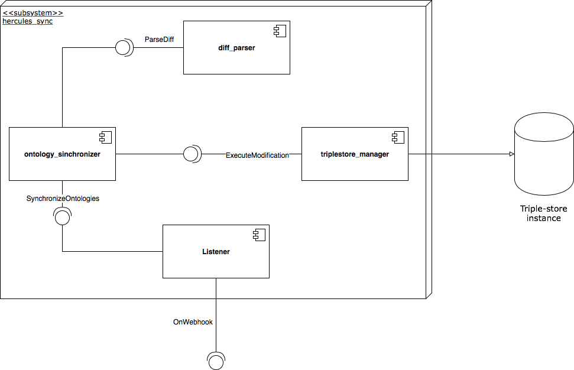

# Documentación del módulo hercules-sync

## Tabla de contenido
<!-- TOC depthFrom:2 depthTo:6 withLinks:1 updateOnSave:0 orderedList:1 -->

1. [Introducción](#introducción)
2. [Alcance](#alcance)
3. [Requisitos](#requisitos)
	1. [Requisitos funcionales](#requisitos-funcionales)
	2. [Requisitos no funcionales](#requisitos-no-funcionales)
4. [Diseño](#diseño)
	1. [Diagrama de componentes](#diagrama-de-componentes)
	2. [Diseño de clases](#diseño-de-clases)
		1. [Componente listener](#componente-listener)
		2. [Componente diff_parser](#componente-diffparser)
		3. [Componente ontologies_synchronizer](#componente-ontologiessynchronizer)
		4. [Componente triplestore_manager](#componente-triplestoremanager)
5. [Implementación](#implementación)
	1. [Guías de estilo](#guías-de-estilo)
	2. [Tecnologías utilizadas](#tecnologías-utilizadas)
		1. [Python](#python)
		2. [Flask](#flask)
		3. [WikidataIntegrator](#wikidataintegrator)
		4. [Pytest](#pytest)
		5. [Travis](#travis)
		6. [Codacy](#codacy)
6. [Anexos](#anexos)
	1. [A. Pruebas](#a-pruebas)
		1. [A.1. Fase de diseño](#a1-fase-de-diseño)
		2. [A.2. Fase de implementación](#a2-fase-de-implementación)
	2. [B. Integración continua](#b-integración-continua)

<!-- /TOC -->

## Introducción
En este documento se presenta la documentación del módulo de sincronización - llamado a partir de ahora _hercules\_sync_ - entre ficheros de ontologías y un Triple-store, que forma parte de la Infraestructura Ontológica del proyecto Hércules.

## Alcance
El módulo _hercules\_sync_ se encarga de recibir actualizaciones de las ontologías y shapes que se encuentran almacenadas en un sistema de control de versiones. Cuando recibe una actualización, deberá procesar los cambios que se han realizado en las ontologías y/o shapes y reflejar estos cambios en el triple store en el que se encuentren almacenadas.

## Requisitos
A continuación se indican los requisitos de alto nivel identificados en la toma de requisitos del sistema. Éstos se encuentran divididos en requisitos funcionales y no funcionales:

### Requisitos funcionales
| Código        | Descripción          |
|:-------------:|:-------------|
| RF1      | El sistema establecerá un punto de entrada por el cuál recibir información sobre las actualizaciones de las ontologías. |
| RF2 | El sistema procesará la información recibida del CVS relativa a la actualización de las ontologías. |
| RF3 | El sistema detectará los cambios a realizar en el triple-store a partir de la información sobre las actualizaciones procesada.  |
| RF4 | El sistema se conectará con un triple-store para reflejar los cambios producidos en las ontologías. |
| RF5 | El sistema llevará a cambio la sincronización inversa: de cambios producidos en el triple-store a los ficheros con las ontologías. |
| RF6 | El sistema utilizará herramientas de logging para detectar anomalías en su funcionamiento. |

### Requisitos no funcionales
| Código        | Descripción          |
|:-------------:|:-------------|
| RNF1      | Seguridad: El sistema recibirá notificaciones de actualización del CVS de forma segura utilizando claves RSA. |
| RNF2      | Seguridad: El sistema actualizará el triple-store de forma segura a través del protocolo OAuth. |
| RNF3 | Compatibilidad: El sistema deberá funcionar como mínimo con las versiones 3.6, 3.7 y 3.8 del lenguaje de programación Python. |
| RNF4 | Mantenibilidad: La implementación del sistema seguirá el estándar de código PEP8. |
| RNF5 | Calidad: La cobertura de código de cada nueva versión será de al menos un 90%. |
| RNF6 | Extensibilidad: El sistema facilitará la utilización de distintos triple-stores donde almacenar las ontologías. |

## Diseño
En este apartado se especifica el diseño del módulo _hercules\_sync_. En primer lugar, se adjunta el diagrama de componentes del módulo, junto con una explicación de las responsabilidades de cada componente e interfaz que proporciona. A continuación, introducimos el diseño de las clases de cada componente a más bajo nivel, de nuevo acompañadas de explicaciones del funcionamiento de cada clase del sistema.

### Diagrama de componentes
Los componentes e interfaces detectados son los siguientes:
* listener: Este componente es el punto de entrada al subsistema por parte de otros sistemas externos. Para ello ofrece una interfaz al exterior, llamada OnWebhook, que es la encargada de recibir los datos sobre las actualizaciones de las ontologías por parte del CVS.
* ontology_synchronizer: Este componente realiza la sincronización de los cambios recibidos, creando operaciones a realizar en el triple_store para reflejar estos cambios. Ofrece una interfaz llamada _SynchronizeOntologies_, que es utilizada por el componente listener para sincronizar los cambios recibidos.
* diff_parser: El componente _diff\_parser_ se encarga de procesar la información del diff de los ficheros típica de los sistemas de control de versiones basados en Git. Ofrece una interfaz _ParseDiff_, que es utilizada por el componente _ontology\_synchronizer_ para obtener información detallada sobre los cambios en los ficheros de ontologías.
* triplestore_manager: Por último, el componente _triplestore\_manager_ se encarga de ejecutar las operaciones recibidas del componente _ontology\_synchronizer_ sobre el triple-store elegido. Para ello ofrece el interfaz _ExecuteModification_.

A continuación se muestra el diagrama de componentes del módulo:

### Diseño de clases
En esta sección vamos a mostrar el diseño de clases del módulo. Para facilitar la comprensión y lectura de las clases las hemos dividido en subsecciones correspondientes a cada uno de los componentes detectados en el apartado previo.

> __Singularidades de Python__.  
> Dado que Python es un lenguaje dinámicamente tipado que carece de algunas de las herramientas de otros lenguajes de programación, como las interfaces, haremos las siguientes distinciones en los diagramas UML:
> * Los módulos de Python que estén compuestos únicamente por funciones, y no tengan ninguna clase en su interior, serán tratados como clases estáticas en los diagramas UML.
> * Dado que los modificadores de acceso no se encuentran disponibles en Python, seguimos la convención de que los atributos y funciones cuyo nombre comienza con guión bajo son considerados privados. Estos elementos se mostrarán como privados en los diagramas UML.
> * Como no hay interfaces en Python, representaremos como interfaces aquellas clases abstractas que no tengan ningún atributo o implementación de algún método.
>
> Además, es importante destacar que la filosofía de Python se basa en el Duck typing y no en la implementación de interfaces. Sin embargo, se ha optado por la creación de "pseudo-interfaces" (clases abstractas sin atributos ni métodos implementados) y su extensión por otras clases. Esto se hizo con el fin de especificar explícitamente que una clase sigue una determinada interfaz, en vez de comprobarlo implícitamente al mirar los métodos que la clase provee internamente.

#### Componente listener
* Listener: La clase Listener inicializa el servidor de Flask a través de la AppFactory, y establece el punto de entrada a través del cual llega la información sobre las actualizaciones de las ontologías.
* Webhook: Esta clase gestiona la comunicación con el sistema de control de versiones a través de Webhooks (ver https://developer.github.com/webhooks/) de forma segura con el uso de claves RSA.
* AppFactory: Factoría encargada de crear la aplicación de Flask a partir de una configuración específica.
* Config: Clase de configuración utilizada por el servidor.

  

#### Componente diff_parser
* PushEventHandler: Clase principal con la que se comunicará el listener para procesar la información recibida sobre los cambios producidos en las ontologías.
* PushInfo: Información sobre los datos recibidos por el sistema de control de versiones.
* GitDiffParser: Esta clase se encarga de parsear el diff de los cambios para devolver las líneas que han sido modificadas en cada fichero.
* GitDataLoader: La clase GitDataLoader descarga los datos de cada fichero antes y después de las modificaciones realizadas.
* GitFile: Wrapper que almacena el contenido de un fichero modificado antes y después de la modificación, así como otra metainformación del fichero.

  

#### Componente ontologies_synchronizer
* OntologySynchronizer: Esta clase recibe un algoritmo de sincronización a utilizar y devuelve una lista de operaciones a realizar en el triple-store para reflejar los cambios existentes en los ficheros de ontologías.
* SyncAlgorithm: Interfaz a implementar por cada uno de los algoritmos de sincronización. Estos algoritmos reciben las líneas modificadas en cada fichero y devuelven la lista de operaciones a realizar.
* NaiveSync: Algoritmo de sincronización simple que sobrescribe el contenido del triple-store para que sea consistente con los ficheros de ontologías.
* RDFSync: Algoritmo [RDFSync](https://link.springer.com/content/pdf/10.1007%2F978-3-540-76298-0_39.pdf) para la sincronización de ficheros RDF.
* SyncOperation: Clase abstracta que representa una operación a realizar en el triple-store.

  

#### Componente triplestore_manager
* TripleStoreManager: Interfaz a ser implementada por cada uno de los adaptadores que se conecten con un triple-store particular.
* WikibaseAdapter: Adaptador para conectarse con el triple-store BlazeGraph configurado en una instancia de wikibase.
* ModificationResult: Clase que encapsula el resultado de la modificación realizada en el triple-store.

  

## Implementación

### Guías de estilo
El principal estándar de código seguido para la implementación de módulo es la guía de estilo [PEP 8](https://www.python.org/dev/peps/pep-0008/) de Python. Este estándar especifica cómo se debería formatear (número de caracteres por linea, decisiones de estilo...) todo el código escrito en el lenguaje de programación Python, y está ampliamente adoptado por la comunidad del lenguaje.

En cuanto a la documentación del código también hay una serie de estilos que pueden ser usados. En este caso hemos optado por utilizar el [numpy docstring style](https://numpydoc.readthedocs.io/en/latest/format.html), debido a la facilidad de lectura que proporciona frente a otras alternativas.

### Tecnologías utilizadas

#### Python
El principal lenguaje de programación utilizado para la implementación del módulo _hercules\_sync_ es [Python](https://www.python.org). Python es un lenguaje de propósito general, interpretado y de alto nivel diseñado por Guido van Rossum en 1991. Las principales características de Python son su sintaxis legible y el tipado dinámico.

La elección de Python para este módulo se debe principalmente al amplio abanico de librerías existentes que permiten trabajar con ontologías y triple stores en comparación con otros lenguajes.

El módulo será compatible exclusivamente con Python 3. El 1 de Enero de 2020 se anunció el fin de ciclo de Python 2, siendo Python 3 la versión mantenida actualmente.  

#### Flask
[Flask](https://palletsprojects.com/p/flask/) es un microframework web basado en el estándar [WSGI](https://wsgi.readthedocs.io/en/latest/) que destaca por su flexibilidad y eficiencia.

Flask será utilizado en _hercules\_sync_ para lanzar un servidor web que escuche a las actualizaciones de las ontologías por parte del sistema de control de versiones.

#### WikidataIntegrator
[WikidataIntegrator](https://github.com/SuLab/WikidataIntegrator) es una librería que permite introducir y leer datos sobre entidades en una instancia de Wikibase a través de la API de [MediaWiki](https://www.mediawiki.org/wiki/API:Main_page).

Esta librería es utilizada para introducir las modificaciones que se hayan producido en las ontologías en la instancia de Wikibase donde se encuentra el triple-store.

#### Pytest
Pytest es un framework que facilita la implementación de pruebas con Python. Puede ser utilizado tanto para escribir pruebas sencillas, como para realizar pruebas funcionales más complejas. Las librerías de pruebas que vienen por defecto en el lenguaje, como unittest y doctest, pueden ser facilmente integradas con pytest.

#### Travis
Travis es un servicio de integración continua que puede ser usado para monitorizar y probar proyectos alojados en GitHub.

#### Codacy
Codacy es una herramienta de análisis de código estática que permite la monitorización de calidad de proyectos, con soporte para múltiples lenguajes de programación. Devuelve varias métricas de calidad, como por ejemplo la seguridad, compatibilidad, rendimiento o estilo de código.

## Anexos

### A. Pruebas
#### A.1. Fase de diseño
Para probar el módulo las siguientes técnicas serán utilizadas:
* Técnicas estáticas:
  * Herramientas de análisis de código estático.
* Técnicas dinámicas:
  * Basadas en especificación, con división en clases de equivalencia.

Estas técnicas han sido seleccionadas principalmente debido a la naturaleza del sistema (no hay interfaz gráfica de usuario, por lo que otras técnicas estáticas serían más dificiles de llevar a cabo) y a la experiencia del equipo de desarrollo con la prueba de sistemas relacionados (técnicas basadas en la experiencia no serían apropiadas en este contexto).

Los siguientes niveles de pruebas serán automatizados y documentados para este sistema:
* Pruebas unitarias y de componentes.
* Pruebas de integración.

Además, los siguientes tipos de pruebas serán también automatizados y documentados:
* Pruebas funcionales.
* Pruebas de rendimiento.

#### A.2. Fase de implementación
Las pruebas implementadas, así como los resultados de éstas se añadirán en esta sección a medida que el desarrollo del sistema avance.

### B. Integración continua
En el repositorio del módulo llevamos a cabo prácticas de integración continua con el fin de asegurar algunos de los requisitos no funcionales que se deben cumplir. Antes de que una nueva versión del módulo sea pusheada al repositorio, una build de Travis se lanza donde las pruebas son ejecutadas. Con el fin de poder subir los nuevos cambios a la rama principal, todas las pruebas deben pasar, y tanto la cobertura de código cómo la calidad de éste reportada por Codacy no deben bajar por debajo de un umbral especificado.
